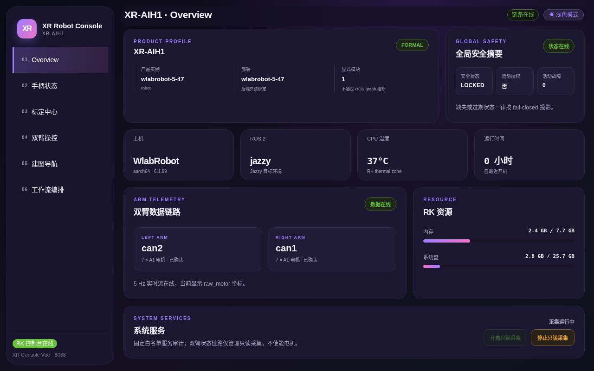
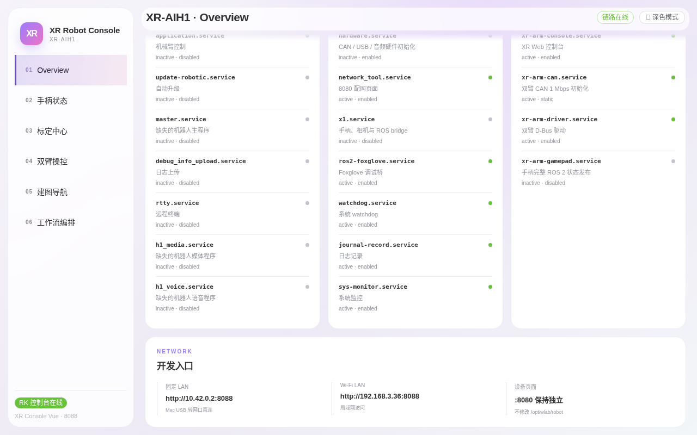

# 第一章：快速上手与总览页

> **本章目标**：打开控制台，认识六页导航结构，逐张读懂总览页卡片，并养成每次开机后的三步健康巡检习惯。
> **涉及文件**：`src/xr_arm_console/xr_arm_console/app.py`（总览页数据来源）

## 打开控制台

1. 确认电脑与机器人在同一局域网；
2. 浏览器访问 `http://<机器人IP>:8088`（无需安装任何软件）；
3. 进入后默认停在 **Overview（总览）** 页。

界面为左侧导航 + 右侧内容的单页应用，六个页面与左侧栏编号一致：

| 编号 | 页面 | 用途 |
|---|---|---|
| 01 | Overview | 总览：产品信息、安全状态、系统健康、服务审计 |
| 02 | 手柄状态 | 手柄输入链路与实时按键映射 |
| 03 | 标定中心 | 整机维护、关节标定、夹爪调试 |
| 04 | 双臂操控 | 3D 工作台、实时角度、升降调试、示教录制 |
| 05 | 建图导航 | 建图、定位、导航点与导航任务 |
| 06 | 工作流编排 | 原子功能拖拽编排与调试 |


*图 1-1：总览页全貌。右上角「链路在线」绿标 + 「状态在线」绿标 = 数据链路正常。*

## 右上角控件

- **链路在线徽标**：绿色 = 控制台与机器人数据链路正常；灰色 = 断开，先检查网络再刷新；
- **深色模式**：点击即切换深/浅主题。切换后所有卡片自动适配，不影响功能：


*图 1-2：深色模式。夜间值守或投影演示时更护眼，偏好会保存在浏览器本地。*

## 总览页卡片逐个读

**① 产品档案**。当前产品（截图为 XR-AIH1 整机）、产品实例名、部署槽位。`FORMAL` 徽标 = 运行正式产品合同而非演示配置。

**② 全局安全摘要**。三个关键指标，每开一次机都应先看这里：

- **安全状态 `LOCKED`**：安全系统处于锁定保护态，运动类操作会被要求额外确认；
- **运动授权 `否`**：当前没有打开运动权限（默认如此，符合「默认不打开运动权限」的设计原则）；
- **活动故障 `0`**：无未清除故障。

**③ 主机信息条**。主机型号、ROS 2 发行版（jazzy）、CPU 温度（RK 热区，长期 > 80°C 需检查散热）、本次开机时长。

**④ 双臂数据链路**。左臂 `can2`、右臂 `can1` 各确认 7 个电机；「数据在线」绿标 + 5 Hz 实时流 = 关节数据持续刷新。**这一项异常时，第四章的实时角度表会停止跳动。**

**⑤ RK 资源**。内存与系统盘占用。内存接近满载时控制台变慢属正常现象。

**⑥ 系统服务**。固定白名单的 systemd 服务审计，右下角两个按钮控制只读采集（仅轮询状态，不启停任何服务）：


*图 1-3：服务审计表。`xr-arm-driver`（双臂 D-Bus 驱动）绿点 = 臂状态链路的核心服务在跑；`x1.service` 灰色 disabled = 原厂整机栈已按设计停用。底部 NETWORK 卡片可直接看到本机的局域网访问地址。*

## 每次开机的三步巡检

1. 右上角「链路在线」是否绿色；
2. 「全局安全摘要」的活动故障是否为 0、安全状态是否 LOCKED；
3. 「双臂数据链路」两张卡是否都显示「7 × A1 电机·已确认」+「数据在线」。

任一异常：先刷新页面 → 仍异常则到「系统服务」表找灰点服务 → 对照售后手册处理。

## 进阶：总览页背后的接口

总览数据来自只读接口 `GET /api/status`（`src/xr_arm_console/xr_arm_console/app.py:1532`），每张卡片对应其中字段：

```python
    @app.get("/api/status")
    def status():
        ros_bridge = app.extensions.get("ros_bridge")
        return jsonify(
            {
                "mode": _console_mode(app),
                "motion_control": _console_mode(app) != "read_only",
                "version": __version__,
                "system": system_snapshot(),
                "arms": app.extensions["joint_cache"].snapshot(),
                "battery": app.extensions["battery_cache"].snapshot(),
                "ros_error": None if ros_bridge is None else ros_bridge.error,
            }
        )
```

该接口无副作用，可在自己的监控脚本中放心轮询（详见第七章）。

## 动手试试

1. 把总览页保持打开 1 分钟，观察「CPU 温度」与「RK 资源」数值小幅波动（= 实时刷新中）。
2. 点击右上角「深色模式」来回切换，确认卡片渲染正常。

## 小结

- 控制台 = 浏览器打开 `:8088`，六个页面覆盖状态查看到流程编排的全部日常操作。
- 三步巡检：链路在线 → 安全摘要零故障 → 双臂链路数据在线。
- 「LOCKED + 运动授权：否」是默认且健康的安全姿态。
- 系统服务表是只读审计：绿点在跑、灰点停用，不放行任意服务操作。
