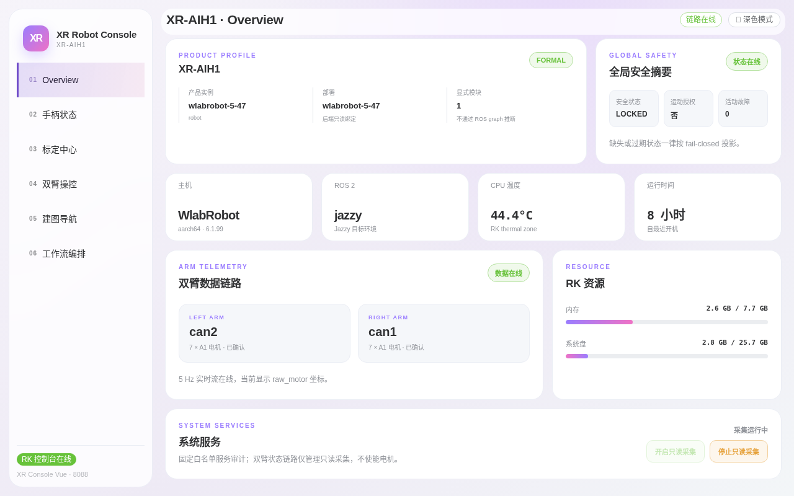

# 第一章：快速上手与总览页

> **本章目标**：打开控制台，认识六页导航结构，能读懂总览页每张卡片的含义，判断机器人是否处于健康状态。
> **涉及文件**：`src/xr_arm_console/xr_arm_console/app.py`（总览页数据来源）

## 打开控制台

浏览器访问 `http://<机器人IP>:8088`，进入控制台唯一入口。界面为左侧导航 + 右侧内容的单页应用，共六个页面，与左侧栏编号一致：

| 编号 | 页面 | 用途 |
|---|---|---|
| 01 | Overview | 总览：产品信息、安全状态、系统健康 |
| 02 | 手柄状态 | 手柄输入链路与实时按键映射 |
| 03 | 标定中心 | 整机维护、关节标定、夹爪调试 |
| 04 | 双臂操控 | 3D 工作台、实时角度、升降调试、示教 |
| 05 | 建图导航 | 建图、定位、导航点与导航任务 |
| 06 | 工作流编排 | 原子功能拖拽编排与调试 |

右上角两个控件值得注意：「链路在线」徽标（绿色=数据链路正常，灰色=断开）和「深色模式」切换（按喜好切换主题，不影响功能）。

## 总览页卡片解读

进入后默认停在 Overview 页：


*图 1-1：总览页全貌。注意右上角「链路在线」绿标与「全局安全摘要」中的 LOCKED 状态。*

从上到下依次是：

**产品档案**。显示当前产品（截图为 XR-AIH1 整机）、产品实例名、部署槽位。「FORMAL」徽标表示运行的是正式产品合同而非演示配置。

**全局安全摘要**。三个关键指标：

- **安全状态 LOCKED**：安全系统处于锁定保护态，运动类操作会被要求额外确认；
- **运动授权：否**：当前没有打开运动权限（默认如此，符合「默认不打开运动权限」的设计原则）；
- **活动故障：0**：当前无未清除故障。

**主机信息条**。主机型号、ROS 2 发行版（jazzy）、CPU 温度（RK 热区温度，长期超过 80°C 需检查散热）与开机运行时长。

**双臂数据链路**。左右臂各占用一路 CAN 总线（左臂 `can2`、右臂 `can1`），各确认到 7 个电机；「数据在线」绿标 + 5 Hz 实时流表示关节数据正在持续刷新。

**RK 资源**。内存与系统盘占用。内存接近满载时控制台可能变慢，属正常现象。

**系统服务**。固定白名单的 systemd 服务审计（如 `xr-arm-driver`、`xr-body-gateway`），「开启只读采集」/「停止只读采集」按钮控制是否持续轮询服务状态——只读，不会启停任何服务。

## 判断机器人是否健康

日常巡检只需看三处：

1. 右上角「链路在线」是否绿色；
2. 「全局安全摘要」的活动故障是否为 0；
3. 「双臂数据链路」两张卡是否都显示「7 × A1 电机·已确认」+「数据在线」。

三者任一异常时，先到第 04 页看双臂角度表是否有数据，再到「系统服务」确认驱动服务状态。

## 进阶：总览页背后的接口

总览页数据来自只读接口 `GET /api/status`，每张卡片对应其中一个字段（`src/xr_arm_console/xr_arm_console/app.py:1532`）：

```python
    @app.get("/api/status")
    def status():
        ros_bridge = app.extensions.get("ros_bridge")
        return jsonify(
            {
                "mode": _console_mode(app),
                "motion_control": _console_mode(app) != "read_only",
                "version": __version__,
                "system": system_snapshot(),
                "arms": app.extensions["joint_cache"].snapshot(),
                "battery": app.extensions["battery_cache"].snapshot(),
                "ros_error": None if ros_bridge is None else ros_bridge.error,
            }
        )
```

该接口无任何副作用，可在自己的监控脚本中放心轮询。接口详情见第七章。

## 动手试试

1. 把总览页在浏览器中保持 1 分钟，观察「CPU 温度」与「RK 资源」数值是否有小幅波动（有 = 数据在实时刷新）。
2. 点击右上角「深色模式」，确认界面切换主题后所有卡片仍正常显示。

## 小结

- 控制台 = 浏览器打开 `:8088`，六个页面覆盖从状态查看到流程编排的全部日常操作。
- 总览页五组卡片：产品档案 / 全局安全 / 主机健康 / 双臂链路 / 系统服务。
- 「LOCKED + 运动授权：否」是默认且健康的安全姿态。
- 总览数据接口 `GET /api/status` 是只读的，可集成到自己的监控。
