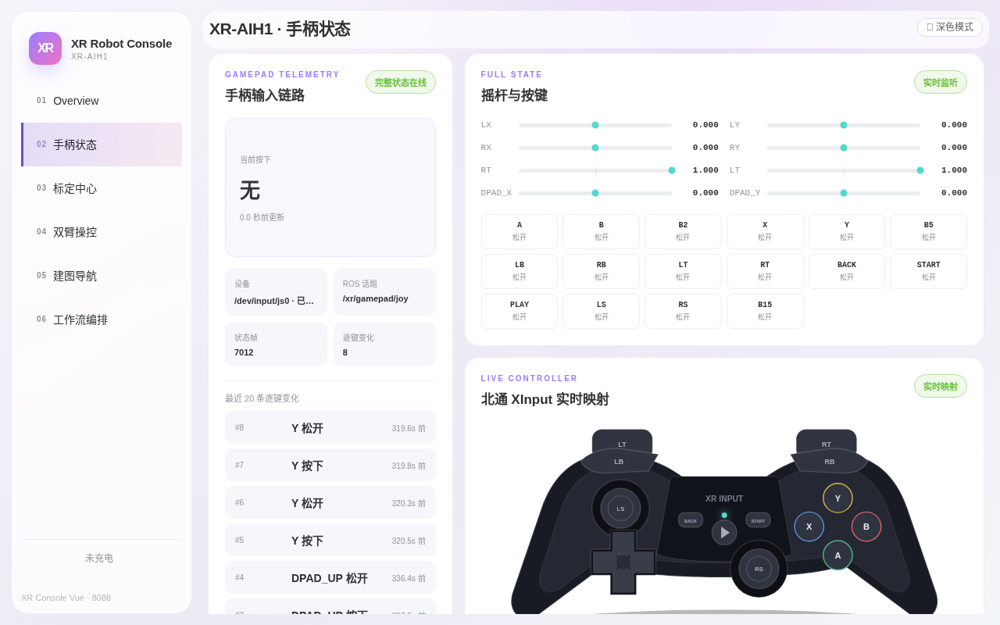

# 第二章：手柄状态监控

> **本章目标**：完成手柄接入自检四步法；能读懂页面五种状态徽标；用「实时映射图 + 事件流」定位"按了没反应"类问题。
> **涉及文件**：`src/xr_arm_console/xr_arm_console/peripherals.py`（手柄话题与机型映射表）

## 这一页是干什么的

整机手柄经机器人上的 `xr-arm-gamepad.service` 采集后发布到 ROS 话题 `/xr/gamepad/joy`，「手柄状态」页把手柄每一帧输入可视化，用途：

- 遥操作/示教前的**标准检查步骤**——确认手柄已连接、按键正常；
- 排障入口——「按了没反应」时，先来这里看按键到底有没有被采到。

该链路**只读**：控制台只显示手柄状态，不产生任何运动指令。手柄的实际控制功能（底盘/升降/头部）由机器人原厂控制链实现，与本页互不影响。

## 先认识五种状态徽标

页面左上角的状态徽标是排障的第一入口：

| 徽标 | 含义 | 常见原因与动作 |
|---|---|---|
| 🟢 完整状态在线 | 设备、话题、数据全部正常 | 无需处理 |
| 🟡 设备缺失 | `/dev/input/js0` 不存在 | 手柄休眠/关机/USB 松动；唤醒手柄即可 |
| 🟡 话题离线 | 话题上没有任何发布者 | 采集服务没在跑，见下文排障口诀 |
| 🟡 状态超时 | 曾在线但帧停止更新 | 手柄休眠中；按任意键唤醒 |
| ⚪ 等待状态 | 页面刚打开，还没收到后端数据 | 刷新页面即可 |

手柄**休眠不算故障**：采集服务在设备消失时每秒自动重试、服务本身保持运行，手柄重新开机后几秒内自动恢复，不需要重启任何服务。

## 手柄接入自检四步法

**第 1 步：确认设备卡片**。手柄开机后，左侧「手柄输入链路」卡片的「设备」栏应显示 `/dev/input/js0 · 已连接`，「ROS 话题」栏为 `/xr/gamepad/joy`：


*图 2-1：在线典型状态——绿色「完整状态在线」徽标、状态帧持续增长（截图中已累计 7012 帧）、右侧「摇杆与按键」面板列出当前机型全部 8 轴 16 键、最近操作出现在「逐键变化」事件流中。*

**第 2 步：看状态帧计数**。手柄正常在线时「状态帧」持续增长（手柄即使不被操作也在持续上报帧）；「逐键变化」只在输入有变化时增长，静止时为 0 属正常。

**第 3 步：按一个键看事件流**。随便按一个键（如 A）：

- 「最近 20 条逐键变化」立即出现一条按下记录，松开后再出现一条松开记录；
- 每个按键独立判定，释放组合键中的一个不会错误清空其他仍按住的键。

**第 4 步：对照实时映射图**。右下角「LIVE CONTROLLER · 北通 Xinput 实时映射」是手柄的图形化镜像：摇杆拨动时圆点移动、按键按下时键帽高亮、扳机（LT/RT）有量程条。「等待输入」徽标在收到第一帧后消失。

## 排障口诀

**按键无反应 → 先看映射图有没有高亮。**

- 有高亮 = 采集正常，问题在下游（业务层），带着事件流记录找售后；
- 无高亮 = 手柄没连上，按徽标对号入座：
  - 「**设备缺失**」：检查手柄是否有电、USB 线/接收器是否插稳。北通部分型号支持 XInput/DInput 模式切换，请固定在 **Xinput 档**；
  - 「**话题离线**」：采集服务没在运行。在机器人上执行 `systemctl is-active xr-arm-gamepad`，非 active 时 `sudo systemctl enable --now xr-arm-gamepad`。


*图 2-2：未接入/休眠时的对照状态——「设备缺失」黄标、「当前按下：无」、状态帧停止增长；接入后自动恢复为图 2-1 的在线状态。*

> 📌 **真实案例（2026-09-05）**：整机（XR-AIH1）切换部署初期，「手柄状态」页长期显示「话题离线」——原因是整机产品此前未默认启用 `xr-arm-gamepad` 服务。现已修复：**整机与纯双臂产品部署时均默认安装该服务并开机自启**，新设备不会再遇到此问题。

## 进阶：机型自动识别与背后的话题

不同批次的整机可能搭配不同型号手柄（轴/键的原始编号顺序不同）。控制台不写死键位表，而是读取系统输入设备名**自动匹配机型映射**（`src/xr_arm_console/xr_arm_console/peripherals.py:31`）：

```python
GAMEPAD_PROFILES = {
    "beitong_asura2s_xinput": {
        "match": ("beitong asura", "asura"),
        "axes": ("LX", "LY", "LT", "RX", "RY", "RT", "DPAD_X", "DPAD_Y"),
        "buttons": ("A", "B", "X", "Y", "LB", "RB", "BACK", "START", "PLAY", "LS", "RS"),
        "dpad_axes": (6, 7),
    },
    "beitong_kp20_usb": {
        "match": ("btp-kp20",),
        "axes": ("LX", "LY", "RX", "RY", "RT", "LT", "DPAD_X", "DPAD_Y"),
        "buttons": (
            "A", "B", "B2", "X", "Y", "B5", "LB", "RB",
            "LT", "RT", "BACK", "START", "PLAY", "LS", "RS", "B15",
        ),
        "dpad_axes": (6, 7),
    },
}
```

现行整机标配**北通 BTP-KP20**（USB 直连）：16 键中 B2/B5/B15 为未占用编号（中性命名）；LT/RT 扳机同时上报模拟量（静息 1.0、按到底 -1.0，映射图的量程条用它）与数字键；摇杆与十字键方向为 +1=右/上。老批次阿修罗 2S 手柄自动匹配上表第一行。若接入了未知型号手柄，页面会以中性名（A0/B3 之类）原样显示，不影响只读监控。

手柄数据话题固定为 `/xr/gamepad/joy`（`src/xr_arm_console/xr_arm_console/peripherals.py:17`）：

```python
GAMEPAD_TOPIC = "/xr/gamepad/joy"
```

消息类型 `sensor_msgs/Joy`（轴/键数量随机型，KP20 为 8 轴 + 16 键）。当前识别到的机型可通过接口字段 `gamepad.mapping_status` 查询（如 `beitong_kp20_usb`），第八章有订阅示例。

## 动手试试

1. 手柄开机进入本页，确认徽标为「完整状态在线」；然后关掉手柄等 10 秒，观察徽标变为「设备缺失」或「状态超时」，再开机验证自动恢复。
2. 按住 A 键不放：事件流只出现一条「按下」；松开时才出现「松开」。同时按住 A + B 再先松开 A，确认 B 仍显示按住（组合键不串扰）。
3. 在机器人上执行 `curl -s http://<机器人IP>:8088/api/peripherals | grep -o '"mapping_status":"[^"]*"'`，确认识别出的机型编号。

## 小结

- 本页只读、可视化手柄输入，是遥操作/示教前的标准检查点；手柄控制功能走原厂控制链，与本页互不影响。
- 四步自检：设备路径在 → 状态帧增长 → 按键出事件 → 映射图高亮。
- 五种徽标对应五种状态：「设备缺失」找手柄电源/线缆，「话题离线」找 `xr-arm-gamepad` 服务。
- 控制台按设备名自动匹配机型键位表（现行 KP20 为 8 轴 + 16 键），换型号手柄不需要改配置。
