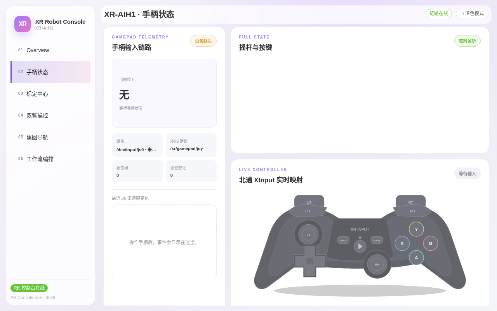

# 第二章：手柄状态监控

> **本章目标**：在「手柄状态」页确认手柄输入链路是否正常，看懂实时按键映射图与逐帧变化事件。
> **涉及文件**：`src/xr_arm_console/xr_arm_console/peripherals.py`（手柄话题配置）

## 这一页是干什么的

整机标配北通（Betop）手柄，经机器人上的 `xr-arm-gamepad.service` 采集后发布到 ROS 话题 `/xr/gamepad/joy`。「手柄状态」页把手柄的每一帧输入可视化，用于：

- 确认手柄已连接、电量与按键正常（遥操作前的检查步骤）；
- 排查「按了没反应」类问题——先来这里看按键有没有被采到。

该链路**只读**：控制台只显示手柄状态，不产生任何运动指令。

## 手柄输入链路卡片

左侧「手柄输入链路」卡片是链路健康的核心：


*图 2-1：截图时刻手柄未连接，「设备缺失」黄标 + 「当前按下：无」即为未接入的典型状态。*

- **当前按下**：正在按住的组合键名称；无按键时显示「无 · 等待完整状态」。
- **设备**：手柄在系统中的设备路径（截图中的「未…」表示设备未插入）。
- **ROS 话题**：固定为 `/xr/gamepad/joy`。
- **状态帧**：已收到的总帧数；手柄正常在线时持续增长。
- **逐帧变化**：有变化的帧数；静止不动时为 0 属正常。
- **最近 20 条逐键变化**：事件流，每按一次/松开一次都会出现一条记录。

## 北通 Xinput 实时映射

右侧下方「LIVE CONTROLLER · 北通 Xinput 实时映射」是手柄的图形化镜像：摇杆拨动时对应圆点会移动，按键按下时对应键帽会高亮，扳机（LT/RT）有量程条。「等待输入」徽标表示尚未收到任何输入帧。

排障口诀：**按键无反应 → 先看这里有没有高亮**。有高亮说明采集正常，问题在下游；无高亮说明手柄未连上，检查接收器与设备卡片。

## 快速自检流程

1. 手柄接上接收器并开机，进入本页；
2. 「设备」卡片应显示稳定的 `/dev/input/js0` 类路径，「设备缺失」黄标消失；
3. 随便按一个键，「状态帧」「逐帧变化」开始计数，事件流出现记录；
4. 图形映射区对应键帽高亮。

四步都通过，手柄链路即为健康。

## 进阶：背后的话题

手柄数据由开机自启的采集服务发布（`src/xr_arm_console/xr_arm_console/peripherals.py:17`）：

```python
GAMEPAD_TOPIC = "/xr/gamepad/joy"
```

消息类型为 `sensor_msgs/Joy`（8 轴 + 11 键整帧）。页面从相邻两帧分别计算每个按键的按下与松开事件，因此释放组合键中的一个按键不会错误清空其他仍按住的键。

## 动手试试

1. 断开手柄接收器，刷新本页，确认「设备缺失」黄标出现、状态帧停止增长。
2. 重新连接后按住一个键不放，观察事件流里只出现一条「按下」记录；松开时出现「松开」记录。

## 小结

- 本页只读、可视化手柄输入，是遥操作前的标准检查点。
- 健康判据：设备路径存在 + 状态帧持续增长 + 映射图高亮。
- 数据话题固定为 `/xr/gamepad/joy`（`sensor_msgs/Joy`）。
