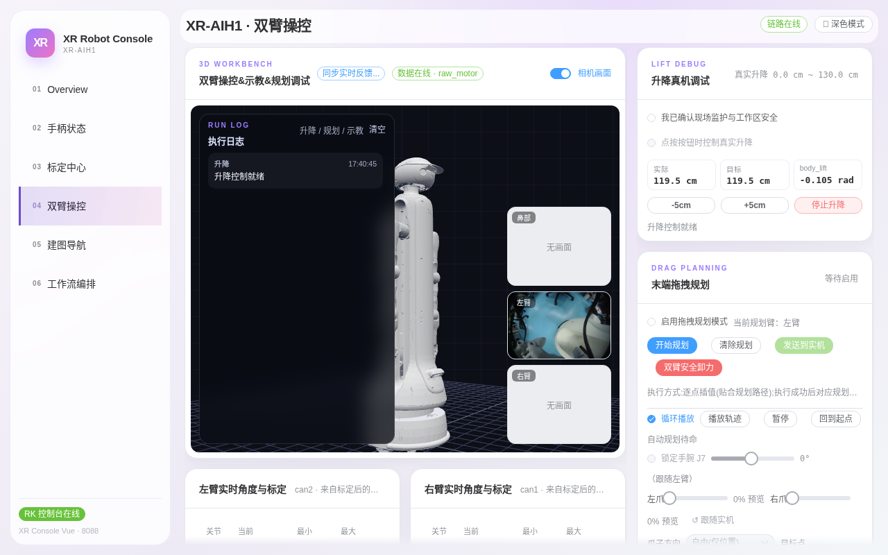
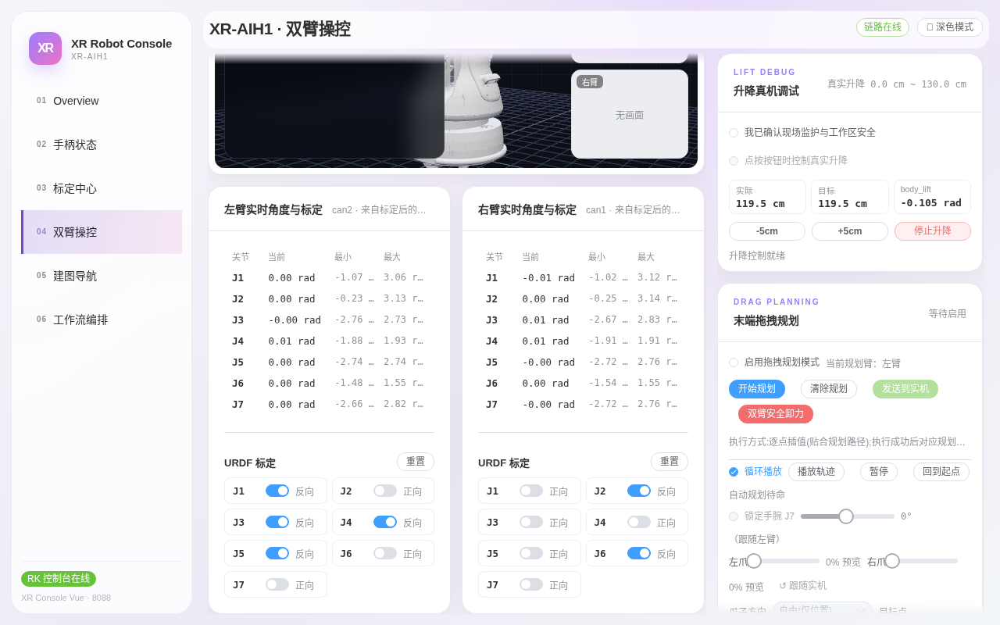
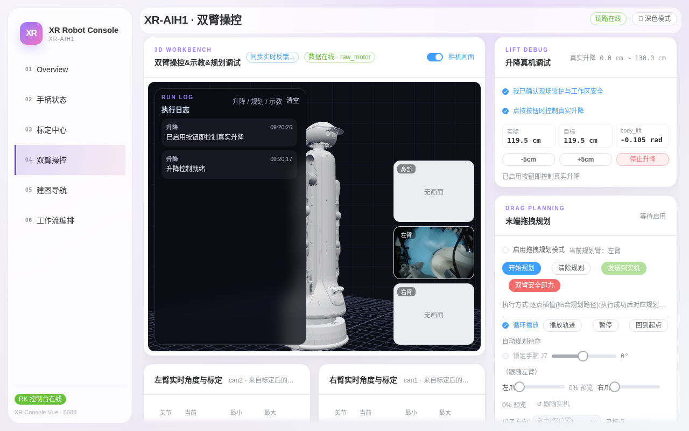
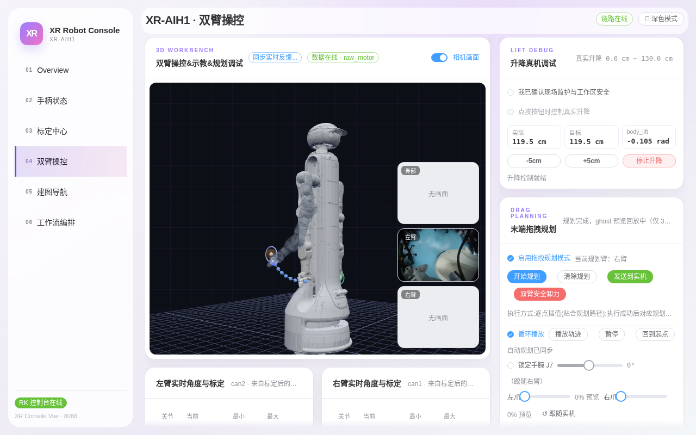
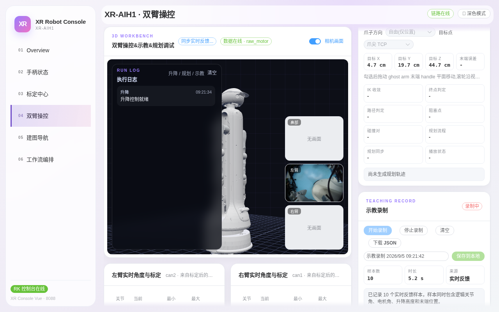
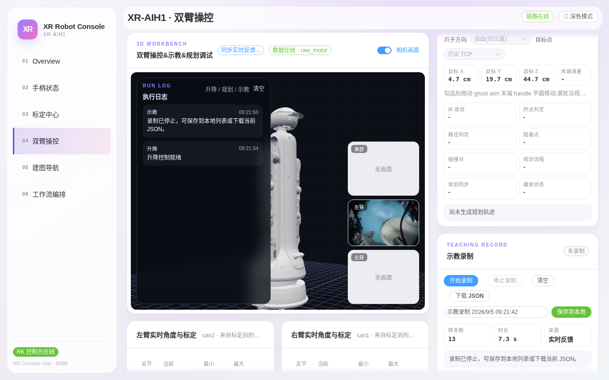
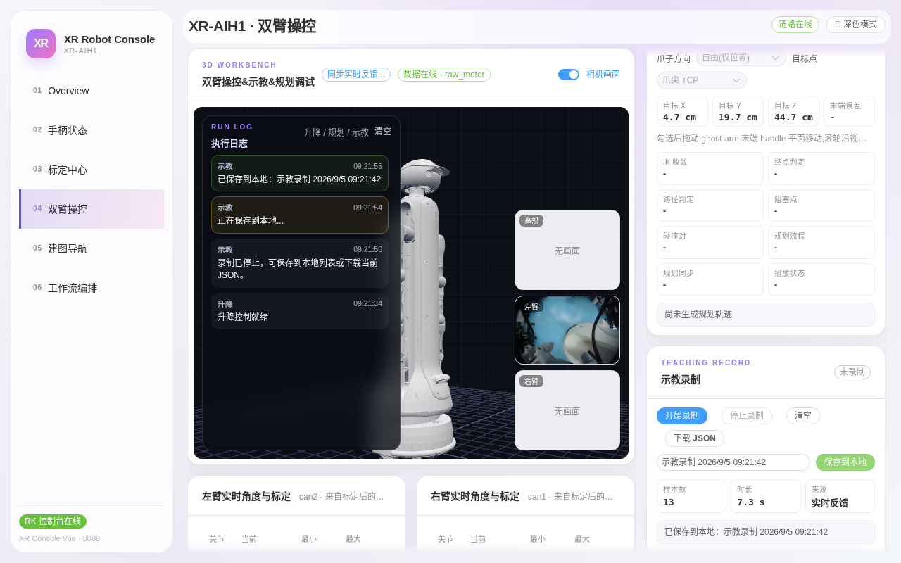

# 第四章：双臂操控

> **本章目标**：完整走通本页四大操作——读 3D 工作台与相机、解锁并使用升降调试、配置拖拽规划、录制并保存一段示教；理解每一步的安全机制。
> **涉及文件**：`src/xr_arm_console/xr_arm_console/app.py`（3D 模型与运动接口）

这是功能最重的一页，集成了 3D 工作台、升降真机调试、拖拽规划、示教录制四大块。**本页所有运动操作都作用于真实机器人**——教程里的截图会带你看每个操作的"解锁前提"，但请始终牢记：点运动按钮前，确认现场安全。

## 3D 工作台与相机画面

*图 4-1：进入页面后模型网格需几秒加载（会显示"加载模型网格…"转圈）；右侧三个小窗是头部/左臂/右臂相机，按需出图。*

**读这个页面**：

- **3D 模型**：按 URDF 实时渲染整机姿态，与真实电机角度同步刷新。它是**展示视图**——不发送指令、不作为安全依据；
- **相机画面开关**（右上角蓝色开关）：控制三个相机小窗。相机是按需发布的，刚打开显示「无画面」属正常，等 1~2 秒出图；始终无图再查相机连接；
- **执行日志（RUN LOG）**：左上角浮层记录每次升降/规划/示教操作及结果，排障先看这里。图中的「升降 控制就绪」就是一条日志。

## 实时关节角与 URDF 标定

3D 视图下方是左右臂各一张「实时角度与标定」表：

*图 4-2：J1~J7 的当前角度（rad）与最小/最大限位，5 Hz 刷新；下方 URDF 标定开关用于模型方向纠偏。*

- 表值持续跳动 = 数据链路健康；全部冻结不动 = 回第一章查双臂链路；
- 「URDF 标定」的**反向**开关**只在 3D 模型转向与实物相反时使用**（显示纠偏，不是运动参数），不清楚不要拨；「重置」可恢复默认。

## 升降真机调试：解锁三步与点动

右侧「LIFT DEBUG · 升降真机调试」面板控制真实升降（行程 0~130 cm）。**默认全部按钮禁用**，必须按顺序解锁：

*图 4-3：勾选「我已确认现场监护与工作区安全」和「点按按钮时控制真实升降」后——勾选变蓝、`-5cm/+5cm` 变为可点、`停止升降` 变红可用，执行日志同步出现「已启用按钮即控制真实升降」。本教程到此为止，不实拍运动过程。*

**完整操作流程**：

1. 勾选两个确认项（顺序不限，都要勾）；
2. 核对面板显示：`实际` 与 `目标` 高度一致、`body_lift` 关节有反馈、「升降控制就绪」；
3. 点 `-5cm` 或 `+5cm` 点动，平台运动中再点同方向可叠加；
4. **到达或任何异常 → 立即点红色 `停止升降`**（急停永远可用）。

**预期现象**：点动后「目标」高度先变，「实际」高度跟随收敛；执行日志记录每次指令。越界（>130 cm 或 <0 cm）会被守卫直接拒绝并在日志给出原因。

## 拖拽规划：从拖拽到生成轨迹的完整实操

「DRAG PLANNING」面板支持在 3D 视图中直接拖拽机械臂末端，实时生成防碰撞轨迹。下面是真机完整实操：

**第 1 步 · 启用规划模式**：勾选「启用拖拽规划模式」（默认规划左臂，可切换）。勾选后系统自动把规划目标对齐当前末端，并在后台做一次初始规划，执行日志依次出现「拖拽规划已启用，可直接拖动 ghost arm 末端 → 左臂正在后台规划 → 规划完成」。

**第 2 步 · 拖拽末端把手**：3D 视图中机械臂末端出现彩色圆环把手（悬停时光标变为抓手形状），按住拖到目标位置。**拖拽停顿的瞬间系统自动重规划**——下图就是拖拽后生成的真实轨迹：

*图 4-4：拖拽规划完成。半透明 ghost 臂是规划姿态的预览，蓝色点线是防碰撞规划轨迹；面板状态为「规划完成，ghost 预览回放中（仅 3D 演示，不下发真机）」——此时机器人完全静止，一切都只是 3D 演示。*

**第 3 步 · 预演**：用 **播放轨迹 / 暂停 / 回到起点 / 循环播放** 在模型上回放——**先预演、后实机**。可选「锁定手腕 J7」防止腕关节翻转，左右臂滑杆可做 0% 空行程预览，勾选「实现 IK 预览同步步」可实时跟随。

**第 4 步 · 发送到实机**：确认轨迹无误后点 **发送到实机**，执行方式为逐点插值（贴合规划路径），执行完成后自动对应规划状态。**这一步才会真实运动**——执行前请确认现场安全。

异常时点红色 **双臂安全卸力** 立即卸力。

## 示教录制与回放

右侧栏底部「TEACHING RECORD · 示教录制」。录制只**采样实时反馈**（逻辑关节角、电机角、升降高度、末端位置），不产生任何运动——你手动拖拽/示教机器人，它负责记。

**完整录制流程（下面三张图为连续实操）**：

**第 1 步 · 开始录制**：点蓝色 `开始录制`，徽标变红「录制中」，样本数与时长持续增长：

*图 4-5：录制进行中。下方说明文字提示：样本同时包含逻辑关节角、电机角、升降高度和末端位置。此时手动拖拽机器人做出的动作正被逐帧记录。*

**第 2 步 · 停止录制**：点 `停止录制`，徽标回到「未录制」，日志提示「录制已停止，可保存到本地列表或下载当前 JSON」：

*图 4-5：停止后样本数与时长定格。此时数据还在暂存区，刷新页面会丢，务必保存。*

**第 3 步 · 保存到本地**：给记录命名（默认为「示教录制 + 时间戳」），点绿色 `保存到本地`：

*图 4-7：执行日志完整记录了本次流程（录制已停止 → 正在保存到本地… → 已保存到本地：示教录制 2026/9/5 09:21:42），面板底部同步显示「已保存到本地」。*

**回放已有记录**：面板下方「本地录制列表」每条记录带四个操作：

- **模拟运行**：只在 3D 模型上回放，不动机器人——**新动作永远先看这个**；
- **真机运行**：经安全链路在真实机器人上回放，运行中请监护现场；
- **下载 / 删除**：导出 JSON 备份（可换机器复用）或删除。

## 动手试试

1. 重走一遍图 4-4 ~ 4-6 的示教流程：录 5 秒小幅动作 → 停止 → 保存 → **模拟运行**观察轨迹。
2. 在升降面板勾选两个确认项看按钮解锁（图 4-3），**不要点 ±5cm**，然后取消勾选，确认按钮回到禁用。
3. 下载一条示教记录的 JSON，打开看采样帧结构（样本数、时长、来源字段）。

## 小结

- 3D 工作台 = 实时姿态镜像 + 按需相机 + 执行日志，是本页的操作中枢。
- 升降调试默认锁死，双确认解锁；`停止升降` 急停永远可用；越界由守卫拒绝。
- 拖拽规划先预演后实机，逐点插值贴合规划路径，异常用「双臂安全卸力」。
- 示教录制只采样不运动；回放务必「模拟运行 → 真机运行」两步走。
