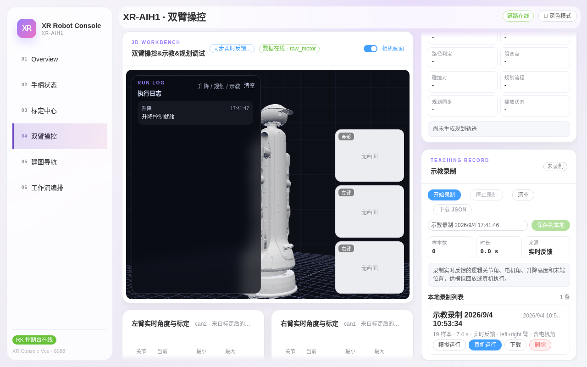

# 第四章：双臂操控

> **本章目标**：掌握「双臂操控」页——3D 工作台与相机预览、实时关节角表、升降真机调试、拖拽规划与示教录制/回放。
> **涉及文件**：`src/xr_arm_console/xr_arm_console/app.py`（3D 模型与运动接口）

这是功能最重的一页，集成了 3D 工作台（示教&规划调试）、升降真机调试、拖拽规划、示教录制四大块。**本页所有运动操作都作用于真实机器人**，操作前请确认现场安全。

## 3D 工作台与相机画面

页面主区是「3D WORKBENCH · 双臂操控&示教&规划调试」：

*图 4-1：进入页面后模型网格需要几秒加载；右侧三个小窗是头部/左臂/右臂相机（按需出图）。*

- **3D 模型**：按 URDF 实时渲染整机姿态，关节角度与真实电机同步刷新。模型是**展示视图**，不发送指令、不作为安全依据；
- **相机画面开关**：右上角蓝色开关控制三个相机小窗。相机按需发布，刚打开时显示「无画面」属正常，等待 1~2 秒出图；始终无图请检查对应相机连接；
- **执行日志**：左上角「RUN LOG」记录每次升降/规划/示教操作及结果，排查问题时先看这里。

## 实时关节角与 URDF 标定

3D 视图下方是左右臂各一张「实时角度与标定」表：

*图 4-2：J1~J7 的当前角度（rad）与最小/最大限位；下方 URDF 标定开关用于修正模型方向与实物方向的符号差。*

- 每行显示关节当前角度与限位区间，数据来自 5 Hz 实时流；
- 「URDF 标定」的**反向**开关只在 3D 模型显示方向与实物不一致时使用（模型方向纠偏），**不是**运动控制参数，不清楚时不要拨动；「重置」可恢复默认。

## 升降真机调试

右侧「LIFT DEBUG · 升降真机调试」面板控制真实升降（范围 0~130 cm）：

1. 勾选两个确认项：**我已确认现场监护与工作区安全**、**点按按钮控制真实升降**——不勾全按钮不可用；
2. 面板实时显示「实际」「目标」高度（cm）与 `body_lift` 关节反馈（rad）；
3. 点 `-5cm` / `+5cm` 点动，任意时刻可点红色 **停止升降** 急停；
4. 「升降控制就绪」为绿色时才接受指令；显示其他状态先解决再操作。

## 拖拽规划

「DRAG PLANNING」面板支持在 3D 视图中拖拽末端生成规划轨迹并下发实机：

- 勾选「启用拖拽规划模式」，选择规划臂（左/右）；
- **开始规划** 后在 3D 视图拖拽目标点，系统生成防碰撞轨迹；
- 「发送到实机」前可用「循环播放 / 播放轨迹 / 暂停 / 回到起点」在模型上预演；
- 执行方式为**逐点插值（贴合规划路径）**，可勾选「锁定手腕 J7」防止腕关节翻转，并用左右臂滑杆做 0% 预览；
- 红色 **双臂安全卸力** 按钮用于异常时立即卸力。

## 示教录制与回放

滚动右侧栏到底部是「TEACHING RECORD · 示教录制」：

*图 4-3：录制会采样实时反馈的逻辑关节角、电机角、升降高度和末端位置，供模拟回放或真机执行。*

工作流：**开始录制** → 拖拽/示教机器人动作 → **停止录制** → 命名后「保存到本地」。下方「本地录制列表」列出已保存的示教记录，每条支持：

- **模拟运行**：只在 3D 模型上回放，不动机器人（新动作先看这个）；
- **真机运行**：经安全链路在真实机器人上回放，运行中请监护现场；
- **下载 / 删除**：导出 JSON 备份或删除记录。

## 动手试试

1. 打开相机画面开关，等待三个小窗出图；关闭再打开，观察按需发布的冷启动延迟。
2. 录一条 5 秒的示教（小幅动作），先「模拟运行」看轨迹，确认后再「真机运行」，全程手放在停止按钮附近。
3. 把一条示教记录「下载」为 JSON，打开看采样帧结构（样本书、时长、来源）。

## 小结

- 3D 工作台 = 实时姿态镜像 + 相机预览 + 执行日志，是本页的操作中枢。
- 升降调试双确认 + 停止按钮，行程 0~130 cm，越界被守卫拒绝。
- 拖拽规划先预演后实机，逐点插值贴合规划路径，支持锁定 J7。
- 示教回放务必「模拟运行 → 真机运行」两步走。
