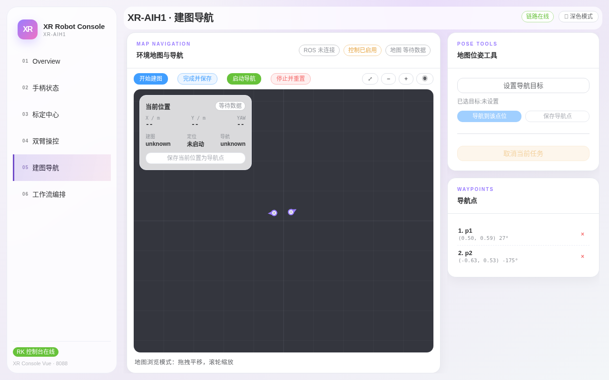

# 第五章：建图导航

> **本章目标**：学会在「建图导航」页完成建图、保存、启动定位、管理导航点与下发导航任务的完整闭环。
> **涉及文件**：`src/xr_arm_console/xr_arm_console/app.py`（导航接口）

导航功能仅 XR-AIH1 整机产品提供。页面分三栏：中间地图画布 + 工具栏，右侧「位姿工具」与「导航点」列表。

## 先读懂顶部三个徽标

*图 5-1：截图时刻原厂导航栈未启动，因此顶部显示「ROS 未连接 / 控制已停用 / 地图 等待数据」——这是导航栈未运行时的正常状态，不代表机器人故障。*

| 徽标 | 含义 |
|---|---|
| ROS 连接（绿/灰） | 与原厂导航节点的数据链路是否在线 |
| 控制已启用/已停用（蓝/黄） | 页面是否允许下发导航命令 |
| 地图（有数据/等待数据） | 是否已加载栅格地图 |

导航相关操作前，先确认三个徽标都处于可用状态；导航栈由部署方案决定是否常驻，未启动时请先启动原厂导航栈或联系售后。

## 工具栏：建图与定位的生命周期

地图上方四个主按钮：

1. **开始建图**：启动 SLAM 建图模式，缓慢推动机器人走遍场地（拐角处减速）；
2. **完成并保存**：结束建图并保存地图，之后才能做定位导航；
3. **启动导航**：以 lastpose 自主定位模式启动——机器人从上次已知位置恢复定位，定位成功后即可下发目标；
4. **停止并重置**：停止当前任务并重置 SLAM 状态（换场地重新建图前使用）。

地图画布支持**拖拽平移、滚轮缩放**（左下角有提示）。左上角「当前位置」卡片实时显示 X/Y/YAW 与建图、定位、导航三个状态；点「保存当前位置为导航点」可把机器人当前位置直接存为导航点。

## 位姿工具：下发导航目标

右侧「POSE TOOLS · 地图位姿工具」：

1. 点「设置导航目标」后在地图上点选目标点与朝向；
2. **导航到该点位**：立即向该点下发导航任务；
3. **保存导航点**：把该点位存入右侧导航点列表，供反复使用；
4. 「取消当前任务」：终止正在执行的导航。

## 导航点管理

「WAYPOINTS · 导航点」列表按序号展示所有已保存导航点（名称、坐标、朝向角），点行尾 × 删除。常用点位（工位、充电点、演示起点）建议建图后第一时间保存。

导航任务进行中**升降会被禁止**（防高空移位倾覆），反之亦然——这是守卫的固定裁决。

## 动手试试

1. 在导航点列表已有点位的情况下（本机默认带 p1、p2 两个示例点），启动导航后选择一个点执行「导航到该点位」，观察地图上机器人位置向目标移动与「当前位置」数值变化。
2. 任务执行中点「取消当前任务」，确认机器人原地停止且状态回到空闲。

## 小结

- 导航页三徽标（ROS / 控制 / 地图）全绿才可下发任务。
- 生命周期：开始建图 → 完成并保存 → 启动导航（lastpose 定位）→ 下发目标。
- 导航点 = 反复可达的收藏位置，可从地图点选或从当前 位置保存。
- 导航与升降互斥，由守卫强制。
