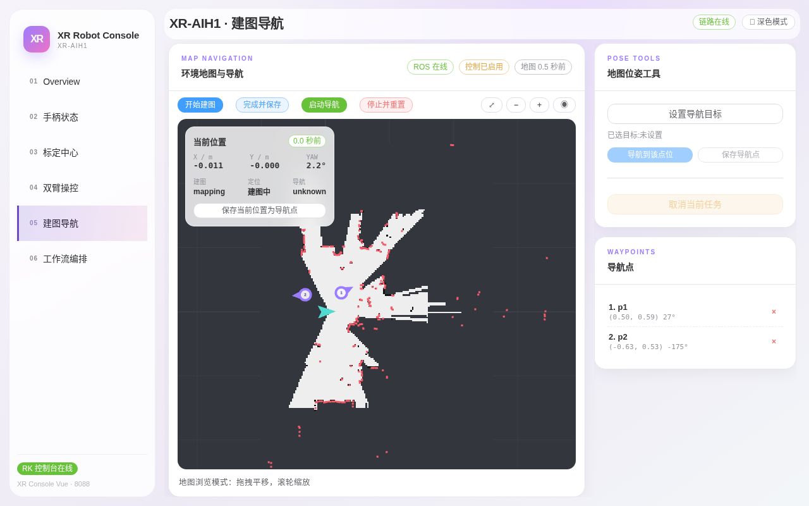

# 第五章：建图导航

> **本章目标**：按正确姿势完成一次建图（含关键的"先转一圈"），走完建图 → 保存 → 定位 → 保存导航点的完整生命周期，并能识别和处理"定位失败"。
> **涉及文件**：`src/xr_arm_console/xr_arm_console/app.py`（导航接口）

导航功能仅 XR-AIH1 整机产品提供。页面分三栏：中间地图画布 + 工具栏，右侧「位姿工具」与「导航点」列表。本章所有截图均为真机实操。

## 先读懂顶部三个徽标

*图 5-1：导航栈就绪时的页面状态——三个徽标全亮（ROS 在线 / 控制已启用 / 地图 0.5 秒前），「当前位置」卡片实时刷新 X/Y/YAW，建图状态 `mapping`。左侧粉红色点是雷达实时回波。*

| 徽标 | 含义 | 不可用时 |
|---|---|---|
| ROS 连接（绿/灰） | 与 SLAM/导航节点的数据链路 | 检查导航栈服务是否启动 |
| 控制已启用/已停用（蓝/黄） | 页面是否允许下发导航命令 | 徽标本体就说明了原因 |
| 地图（有数据/等待数据） | 是否已加载栅格地图 | 需要先完成一次建图 |

## 工具栏：建图与定位的生命周期

地图上方四个主按钮按时间顺序构成完整生命周期。

**第 1 步 · 开始建图（关键：先转一圈！）**：点「开始建图」进入 SLAM 建图模式。**点完按钮后，先让机器人原地缓慢旋转一整圈**，让雷达把四周扫全，再推动它走遍场地补充细节。

> ⚠️ **血泪经验：建图不转圈，导航必翻车。** 建图时如果机器人原地不动（或只扫到半个房间）就直接保存，后续 lastpose 定位会因环境特征不足而不精准，**导航任务会失败**。图 5-3 就是这么来的。

**第 2 步 · 完成并保存**：扫全场地后点它（有确认弹窗）。底部状态栏显示「正在结束建图并保存地图，随后将自动以最后位置重新定位」，建图状态从 `mapping` 变回 `idle`：

*图 5-2：保存完成。此时地图已持久化，换天重启后仍可复用。*

**第 3 步 · 启动导航**：以 lastpose 自主定位模式启动——机器人从上次已知位置恢复定位。**定位成功的标志**：「当前位置」卡片的 `定位` 状态停止报错、X/Y/YAW 持续刷新且「0 秒前」。

**如果看到 `定位失败`**（下图）：

*图 5-3：定位失败状态（`定位: 定位失败`、导航 `stop`）。典型原因就是建图时没先转一圈、环境特征没扫全。处理办法：点「停止并重置」→ 重新建图，这次记得先原地转一圈。*

**第 4 步 · 停止并重置**：停止当前任务并重置 SLAM 状态。换场地重新建图、或定位漂移想重来时使用。

地图画布支持**拖拽平移、滚轮缩放**（底部有提示）。「当前位置」卡片上的「保存当前位置为导航点」可把机器人脚下位置直接存为导航点。

## 导航点的两种创建方式

**方式 A · 从地图点选**：右侧「POSE TOOLS · 地图位姿工具」→ 点「设置导航目标」→ 在地图上点选目标点与朝向 → 点 **保存导航点**（想立刻过去则点 **导航到该点位**）。

**方式 B · 保存当前位置**：把机器人推到/导航到目标位置 → 「当前位置」卡片 → 点「保存当前位置为导航点」。

下图是方式 B 的实操结果：导航点列表新增第 3 条「点位 10:05:23 AM」，地图上同步出现紫色标记：

*图 5-4：导航点保存成功，底部状态栏提示「已保存导航点：点位 10:05:23 AM」。列表中每条导航点带坐标与朝向角，点行尾 × 可删除。*

**任务互斥**：导航任务进行中升降会被禁止（防高空移位倾覆），反之升降运动中也不能下发导航——由守卫强制，拒绝时界面会给出原因。

## 动手试试

1. 完整走一遍正确姿势的建图：开始建图 → **原地转一整圈** → 走场 → 完成并保存 → 启动导航，确认定位成功（对照图 5-1 与图 5-3 的区别）。
2. 用两种方式各保存一个导航点，然后删掉其中一个。
3. （可选）选一个导航点执行「导航到该点位」，全程监护；执行中点「取消当前任务」验证急停。

## 小结

- **建图先转一圈再走场**——环境特征扫不全，lastpose 定位就会失败，这是导航翻车的头号原因。
- 生命周期：开始建图（转圈+走场）→ 完成并保存 → 启动导航 → 下发目标；重置用于换图重来。
- 定位成功的判据：X/Y/YAW 持续刷新、`定位` 状态无失败字样。
- 导航与升降互斥，由守卫强制。
