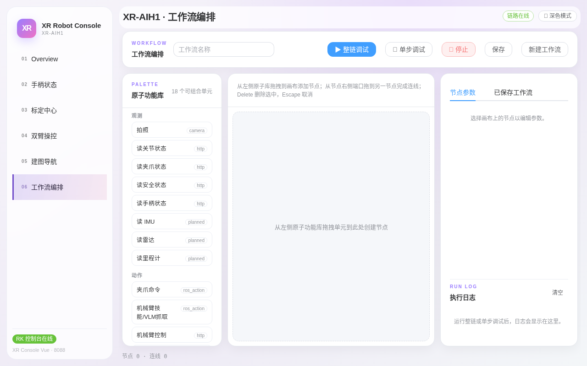

# 第六章：工作流编排

> **本章目标**：认识原子功能库，学会在画布上拖拽节点、连线、配置参数，并用整链调试/单步调试验证一条工作流。
> **涉及文件**：`src/xr_arm_console/xr_arm_console/app.py`（`/api/skills` 技能注册表）

「工作流编排」页把机器人能力拆成 18 个**原子功能**（拍照、读状态、夹爪命令、导航……），用拖拽方式串成一条可反复执行的自动化流程——比如「拍照 → 读关节状态 → 导航到工位」。

## 界面布局


*图 6-1：左「PALETTE 原子功能库」（18 个可组合单元）、中画布、右「节点参数 / 已保存工作流」两个页签 + 执行日志。*

- **顶部工具条**：工作流名称输入框 + `整链调试`（蓝）、`单步调试`、`停止`（红）、`保存`、`新建工作流`；
- **画布操作**（画布上方有内置提示）：从左侧库**拖拽**单元到画布创建节点；从节点右侧端口**拖到**另一节点完成连线；**Delete** 删除选中；**Escape** 取消当前操作。

## 原子功能库：观察 / 动作 / 等待

左侧库按类型分组，每个单元带能力标签（camera / http / ros_action / navigation / timer…）：

| 分组 | 单元 |
|---|---|
| 观察 | 拍照、读关节状态、读夹爪状态、读安全状态、读手柄状态、读 IMU*、读雷达*、读里程计* |
| 动作 | 夹爪命令、机械臂技能/VLM 抓取、机械臂控制、安全卸力、播放示教、启动导航、导航到点、升降控制 |
| 等待 | 延时等待、条件等待 |

带 * 的单元当前为 `planned`（规划中，尚未开放）。每个单元的可用性以「技能注册表」为准，页面上拉取自 `GET /api/skills`，真实数据形如：

```json
{
  "id": "capture-camera",
  "label": "拍照",
  "type": "observe",
  "interface": "camera",
  "availability": "available",
  "params": [
    {"key": "camera", "label": "相机", "type": "enum",
     "values": ["head", "left", "right"], "default": "head"}
  ]
}
```

`availability` 有三档：`available`（可用）、`contract-only`（合同已定义、真实执行走安全评审，如机械臂技能/VLM 抓取）、`planned`（未开放）。

## 节点参数与调试

点选画布上的节点后，右侧「节点参数」页签可编辑该节点的参数（如拍照节点的相机选择）。调试验证分两档：

- **单步调试**：只执行选中的单个节点，验证参数与链路；
- **整链调试**：从起点执行整条工作流，执行日志（RUN LOG）逐节点打印结果。

调试无误后点「保存」；已保存的工作流在右侧「已保存工作流」页签中管理，可随时载入画布修改。

## 一个最小示例

搭建一条最简单的观察流：把「拍照」拖入画布 → 参数选 `head` 相机 → 点该节点的**单步调试** → 执行日志显示拍照结果。再串一个「读关节状态」，连线后「整链调试」，日志按顺序出现两条记录——即完成第一次工作流编排。

## 动手试试

1. 搭建「拍照（head）→ 读安全状态」两节点工作流，整链调试并查看执行日志。
2. 把这条工作流命名保存，刷新页面后从「已保存工作流」重新载入。

## 小结

- 工作流 = 原子功能节点 + 连线 + 参数，18 个单元覆盖观察/动作/等待。
- 单步调试验证单节点，整链调试验证全流程；执行日志是排障入口。
- 单元可用性分 `available` / `contract-only` / `planned` 三档，以注册表为准。
- 涉及真实运动的单元（夹爪、升降、导航）在工作流中同样受安全门控约束。
