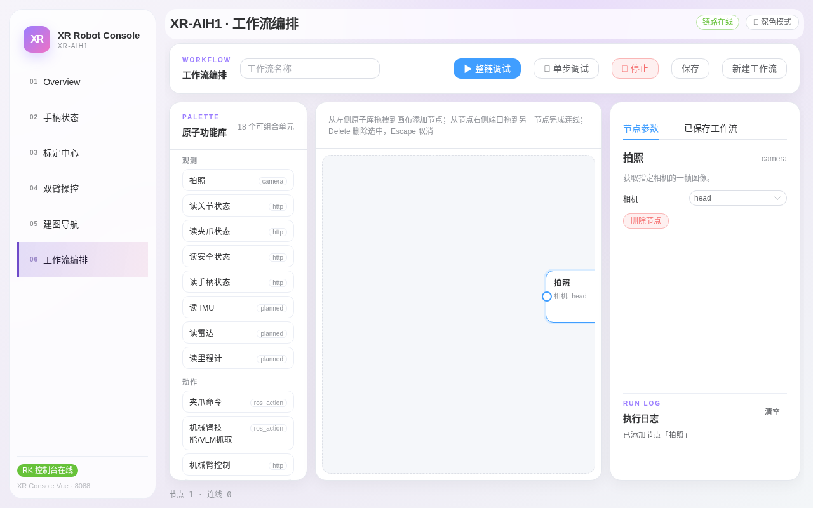
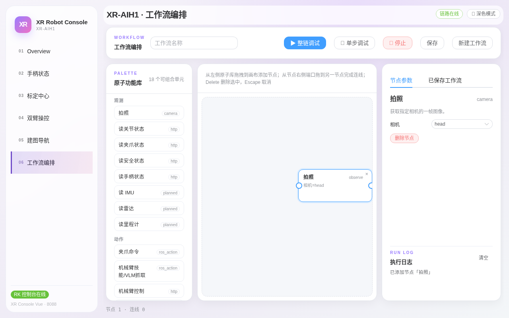
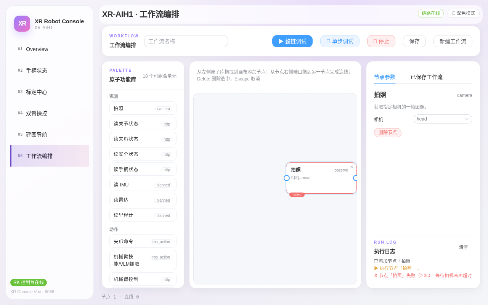

# 第六章：工作流编排

> **本章目标**：从零搭一条「拍照」工作流并单步调跑到成功——包括处理"相机超时"这一真实必遇的坑；理解 18 个原子单元的分类与可用性。
> **涉及文件**：`src/xr_arm_console/xr_arm_console/app.py`（`/api/skills` 技能注册表）

「工作流编排」页把机器人能力拆成 18 个**原子功能**（拍照、读状态、夹爪命令、导航……），拖拽串成可反复执行的自动化流程。本章带你完整实操一条最小工作流，所有截图均为真机逐步操作。

## 界面布局


*图 6-1：左「PALETTE 原子功能库」（18 个可组合单元）、中画布、右「节点参数 / 已保存工作流」两个页签 + 执行日志。*

画布上方有内置操作提示：**拖拽**库中单元到画布创建节点；从节点右侧端口**拖到**另一节点完成连线；**Delete** 删除选中；**Escape** 取消当前操作。顶部工具条：工作流名称 + `整链调试`（蓝）/`单步调试`/`停止`（红）/`保存`/`新建工作流`。

## 实操：搭一条「拍照」工作流并跑通

**第 1 步 · 添加节点**：按住「观察」分组里的 `拍照` 拖到画布中央松手：


*图 6-2：节点已落画布（带左右两个连接端口），底部状态栏显示「节点 1 · 连线 0」。*

**第 2 步 · 配置参数**：点击节点，右侧「节点参数」页签显示该节点参数（描述 + 相机选择下拉）：


*图 6-3：选中节点后右侧出现参数面板。拍照节点的「相机」下拉可选 head / left / right，默认 head。*

**第 3 步 · 单步调试（第一次：遇到真实报错）**：点顶部 `⏯ 单步调试`。下图为真机第一次运行的结果——**失败了**：


*图 6-4：执行日志三级记录：已添加节点【拍照】→ 执行节点【拍照】… → 节点【拍照】失败(2.3s)：等待相机画面超时。这不是 bug：相机是按需发布的，head 相机当前没有发布者，冷启动等待超时。*

**第 4 步 · 换参数重跑（成功）**：把「相机」参数改为 `left`，再点一次 `⏯ 单步调试`：


*图 6-5：节点变绿 `succeeded`，日志显示「节点【拍照】完成 (0.8s)：已获取 left 相机一帧画面」，右下角直接展示拍到的真实画面。*

> **这个失败是宝贵的一课**：观察类节点依赖的数据源（相机）是按需启动的，第一次运行可能超时——**重试一次**或换一个在线的数据源即可。第七章 API 的相机接口也是同样的行为。

**第 5 步 · 保存**：顶部输入工作流名称 → 点 `保存`。之后在右侧「已保存工作流」页签可随时载入画布继续编辑。

后续可以继续拖入 `读关节状态`、`读安全状态` 等节点并从端口连线，用 `▶ 整链调试` 按顺序跑完整条链——执行日志会逐节点打印结果。

## 原子功能库：观察 / 动作 / 等待

| 分组 | 单元 |
|---|---|
| 观察 | 拍照、读关节状态、读夹爪状态、读安全状态、读手柄状态、读 IMU*、读雷达*、读里程计* |
| 动作 | 夹爪命令、机械臂技能/VLM 抓取、机械臂控制、安全卸力、播放示教、启动导航、导航到点、升降控制 |
| 等待 | 延时等待、条件等待 |

带 * 的单元当前为 `planned`（规划中，尚未开放）。单元的可用性由「技能注册表」决定（页面数据来自 `GET /api/skills`），真实数据形如：

```json
{
  "id": "capture-camera",
  "label": "拍照",
  "type": "observe",
  "interface": "camera",
  "availability": "available",
  "params": [
    {"key": "camera", "label": "相机", "type": "enum",
     "values": ["head", "left", "right"], "default": "head"}
  ]
}
```

`availability` 三档含义：`available`（可用）、`contract-only`（合同已定义、真实执行走安全评审，如机械臂技能/VLM 抓取）、`planned`（未开放）。

## 动手试试

1. 重走本章五步，但把节点换成 `读关节状态`（http 接口，无冷启动问题，应一次成功）。
2. 搭「拍照(left) → 读安全状态」两节点链并连线，整链调试，观察日志按序输出。
3. 给工作流命名保存，刷新页面后从「已保存工作流」重新载入。

## 小结

- 工作流 = 原子功能节点 + 连线 + 参数；单步调试验证单节点，整链调试验证全流程。
- 观察类节点可能因数据源按需启动而首跑超时——重试或换在线数据源。
- 执行日志是排障唯一入口，逐节点给出耗时与失败原因。
- 涉及真实运动的单元（夹爪、升降、导航）在工作流中同样受安全门控约束。
